# Markov Localization and the Kidnapped Vehicle

The localization module culminates in the Kidnapped Vehicle situation. In this situation, our vehicle has been kidnapped and placed in an unknown location. We must leverage our knowledge of localization to determine where our vehicle is.

Markov Localization or Bayes Filter for Localization is a generalized filter for localization and all other localization approaches are realizations of this approach. By learning how to derive and implement this filter, we develop intuition and methods that will help us solve any vehicle localization task, including implementation of a particle filter.

We generally think of our vehicle location as a probability distribution, each time we move, our distribution becomes more diffuse (wider). We pass our variables (map data, observation data, and control data) into the filter to concentrate (narrow) this distribution, at each time step.

## 1. Localization Posterior

#### 1.1 Introduction:

What we want to estimate is the transformation between the local coordinate system of the car and the global coordinate system of the map. If we know this transformation, then we also know poses of the car in the global map.

**We assume these variables are known:**

* A map with all landmarks in a global coordinate system, which could be a grid map of the global environment, or a database, which includes global feature points and the lane geometry. Here, we do not add the time index t to the map because we assume the map does not change over time (**m** represents the map, which could be grid maps, feature maps, landmarks).


* Observations from the on-board censor, which are defined as a vector **z**, which includes all observations from timestep one to t. The observations could be range measurements, bearing angles, or images (**z<sub>1:t</sub>** represents the observation vector from time 0 to t (range measurements, bearing, images, etc)). 


* The local coordinates system and the information how the car moves between two time steps. We also have the controls of the car as a vector **u** which includes all control elements from time step one to t. Typically, you have low pitch or roll rates and velocity information (**u<sub>1:t</sub>** represents the control vector from time 0 to t (yaw/pitch/roll rates and velocities)).


**These values are unknown:**

The position of the car at time t is defined with **x**, If we assume we have a 2D map for example, x includes a position with x and y coordinates and the orientation phi.


* x and y coordinates and also the orientation phi (**x<sub>t</sub>** represents the pose (position (x,y) + orientation θ)).


<p align="right">  </p> 

We will never know the state **x<sub>t</sub>** with perfect accuracy. What we want is to form a sufficiently accurate belief of the state  **x<sub>t</sub>** and we want to formulate this belief in a probabilistic way. The definition of the posterior distribution for the state x at time t can be explained like below:

<p align="right"> 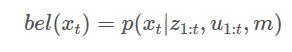 </p> 

#### 1.2 Explanation:


Localization is all about estimating the probability distribution of the state xt, which is the pose of the car, another condition that all previous observations that from time 1 to t (see above figure). Before we go deeper into math, I want to show you how we define the different input data for a specific 1D localization scenario. This means I will explain and show you how the car is sensing and moving and how the map looks.

1. Map

* The map includes the position of street lamps and trees in 1D, this means we are working with landmark-based maps, which are, in general, sparser than grid-based maps. In the 1D case, the map is a vector of the position where these objects are. Here, the map includes six landmarks with the values 9, 15, 25, 31, 59, and 77. 

<p align="right">  </p> 


2. Observation

* For the observation, we state that the car measures the nearest k seen static objects, in driving direction. 
* We assume that the car can detect the distances to street lamps and trees, this results in an observation list which includes, for each time stamp t, a vector of distances z<sub>t</sub>, from 1 to z<sub>t</sub><sup>k</sup>.

<p align="right">  </p> 

3.  Control vector

* The control vector includes a direct move of the car between consecutive time stamps. This means the control is defined by the distance the car traveled between t and t minus 1. In this case, the car moves 2 meters to the right. 

<p align="right">  </p> 


**The true pose of the car is somewhere on the mapped area. Since the map is discrete, the pose of the car could be any integer between 0 and 99 meters. This means the belief of x<sub>t</sub> is defined as a vector of hundred elements, and each element represents a probability that the car is located at the corresponding position. The goal is now to estimate these values.**

<p align="right">  </p> 


## 2. Bayes' Filter For Localization

We can apply Bayes' Rule to vehicle localization by passing variables through Bayes' Rule for each time step, as our vehicle moves. This is known as a Bayes' Filter for Localization. The generalized form Bayes' Filter for Localization is shown below.

<p align="right">  </p> 

With respect to localization, these terms are:


1.	P(location∣observation): This is P(a|b), the normalized probability of a position given an observation (posterior). 
2.	P(observation∣location): This is P(b|a), the probability of an observation given a position (likelihood)
3.	P(location): This is P(a), the prior probability of a position 
4.	P(observation): This is P(b), the total probability of an observation

Without going into detail yet, be aware that P(location) is determined by the motion model. The probability returned by the motion model is the product of the transition model probability (the probability of moving from x<sub>t−1</sub> --> x<sub>t</sub> and the probability of the state x<sub>t−1</sub>.


In the next sections, our focus will be on:
1.	Compute Bayes’ rule
2.	Calculate Bayes' posterior for localization
3.	Initialize a prior belief state
4.	Create a function to initialize a prior belief state given landmarks and assumptions


#### 2.1 Calculate Localization Posterior:

To continue developing our intuition for this filter and prepare for later coding exercises, some examples for determining posterior probabilities at several pseudo positions x, for a single time step is [Here](https://github.com/A2Amir/Markov-Localization-and-the-Kidnapped-Vehicle-/blob/master/Python/Markov%20Localization%20.ipynb) prepared. You can go through to get better Intuition about Calculation of Localization

<p align="right">  </p> 


#### 2.2 Initialize Belief State:

To help develop an intuition for this filter and prepare for later coding exercises, let's walk through the process of initializing our prior belief state. That is, what values should our initial belief state take for each possible position? Let's say we have a 1D map extending from 0 to 25 meters. We have landmarks at x = 5.0, 10.0, and 20.0 meters, with position standard deviation of 1.0 meter. If we know that our car's initial position is at one of these three landmarks, how should we define our initial belief state?

Since we know that we are parked next to a landmark, we can set our probability of being next to a landmark as 1.0. Accounting for a position precision of +/- 1.0 meters, this places our car at an initial position in the range [4, 6] (5 +/- 1), [9, 11] (10 +/- 1), or [19, 21] (20 +/- 1). All other positions, not within 1.0 meter of a landmark, are initialized to 0.
We normalize these values to a total probability of 1.0 by dividing by the total number of positions that are potentially occupied. In this case, that is 9 positions, 3 for each landmark (the landmark position and one position on either side). This gives us a value of 1.11E-01 for positions +/- 1 from our landmarks (1.0/9). So, our initial belief state is:

```python
from decimal import Decimal
print('%.2E' %Decimal((1.0)/9 ))
```
'1.11E-01'

{0, 0, 0, 1.11E-01, 1.11E-01, 1.11E-01, 0, 0, 1.11E-01, 1.11E-01, 1.11E-01, 0, 0, 0, 0, 0, 0, 0, 1.11E-01, 1.11E-01, 1.11E-01, 0, 0, 0, 0}

You can find [Here](https://github.com/A2Amir/Markov-Localization-and-the-Kidnapped-Vehicle-/blob/master/Python/Markov%20Localization%20.ipynb) other example to get better Intuition.In the next concept, we will implement belief state initialization in C++.


#### 2.3 Initialize Priors Function:

[Here](https://github.com/A2Amir/Markov-Localization-and-the-Kidnapped-Vehicle-/blob/master/C%2B%2B/InitializePriorsFunction.cpp) is created a function in C++ that initializes priors based on the above explained agreement (initial belief state for each position on the map) given landmark positions, a position standard deviation (+/- 1.0), and the assumption that our car is parked next to a landmark.Note that we input a control of moving 1 step but our actual movement could be in the range of 1 +/- control standard deviation. The position standard deviation is the spread in our actual position.

The result of the code:
[0, 0, 0 ,0, 0.111111, 0.111111, 0.111111 ,0, 0, 0.111111, 0.111111, 0.111111 ,0 ,0 ,0 ,0 ,0 ,0, 0, 0.111111, 0.111111, 0.111111, 0 ,0, 0]


## 3. How Much Data: Explanation

Before we go back to math, I want to make sure you understand how much data Z<sub>1:t</sub> represents, so you can consider what the performance consequences would be. So let's pretend that

* The car has driven for 6 hours (6*60(min)*60(second))
* LIDAR refreshes 10 times per seconds (10 Hertz)
* LIDAR sends 100,000 data points per observation
* Each of the 100,000 observations contains 5 pieces of data
* Each piece of data requires 4 bytes


How much data is contained in this Z<sub>1:t</sub>?  Multiplying out gives **432 GB** of data!

you have a sense of the quantity of the data that a real car would use if it's updates step took into account all historical observations. Later in next section, I will show you how we can get around this limitation.

## 4. Derivation schema

Up to here, there are two problems if we want to estimate the posterior directly. 

* The first one is the localizer must process on each cycle a lot of data. 
* The second is the amount of data increases over time. 
This won't work for real time localizer, In the following, I will present a mathematical proof showing that we can change this so our localizer, 
* only needs to handle a few bytes on each update (A little data bytes per update) 
* handles the same amount of data per update regardless of drive time(amount of data remains constant). 
let's start with an overview of what we want to achieve. 

#### 4.1 Apply Bayes Rule with Additional Conditions:

You already learned the observation vector could be a lot of data, and we do not want to carry the whole observation history to estimate the state beliefs. We aim to estimate state beliefs **bel(x<sub>t</sub>)** without the need to carry our entire observation history. We will accomplish this by manipulating **our posterior (x<sub>t</sub>∣z<sub>1:t−1</sub>,μ<sub>1:t</sub>,m)** obtaining **a recursive state estimator**. For this to work, we must demonstrate that **our current belief bel(x<sub>t</sub>)** can be expressed by the belief **one step earlier bel(x<sub>t−1</sub>)** then use **new data** to update only **the current belief** (see below figure). This recursive filter is known as the Bayes Localization filter or Markov Localization and enables us to avoid carrying historical observation and motion data. 

<p align="right">  </p> 

We will achieve this recursive state estimator using Bayes Rule, the Law of Total Probability, and the Markov Assumption, which involves, making meaningful assumptions about the dependencies between on certain values. 

We take the first step towards our recursive structure by splitting our observation vector **z<sub>1:t</sub>** into **current observations z<sub>t</sub>** and **previous information z<sub>1:t−1</sub>**. The new posterior (see below figure)can then be rewritten as **p(x<sub>t</sub>∣z<sub>t</sub>,z<sub>1:t-1</sub>,u<sub>1:t</sub>,m).**

<p align="right">  </p> 

Because of the presence of multiple conditions within Bayes Rule we use substitution, where **x<sub>t</sub> is a, and the observation vector at time t (z<sub>t</sub> )** .You can see (below figure) as a result of applying Bayes' rule for the localization posterior.

<p align="right">  </p> 

To simplify the normalization part, we define the normalizer as Ether. Ether is one of the original normalization term and this term is a sum of the product of the observation and the motion model over all possible states **x<sub>t</sub><sup>i</sup>**. This also means you only have to define the observation and motion model to estimate the beliefs. 

<p align="right">  </p> 

If we see again the definition of the motion model, you can understand we have no information where the car was before at time t minus one(x<sub>t-1</sub>). This means, no information about the previous state x<sub>t-1</sub>. To solve this problem we can use applying the law of total probability.

<p align="right">  </p> 

As seen in the above figure, we introduce a state x<sub>t-1</sub> and assume the state is given. Then by using the total probanility, the probability distribution of our motion model can be expressed as the integral of p(x<sub>t</sub>) given the previous states(x<sub>t-1</sub>),the previous observations (z<sub>1:t-1</sub>), controls (u<sub>1:t</sub>)and the map multiplied by the probability distribution of  the previous state itself (x<sub>t-1</sub>) over the whole state space x<sub>t-1</sub>. 

let represent the above situation as a graph to visualize the dependencies between the road blocks, because of introducing x<sub>t-1</sub> we are looking at all possible states of the previous time step and then predict where the car would be in the next time step. Since we also have all the other given values (z<sub>1:t-1</sub>,m, u<sub>1:t</sub>) we also use this information to estimate x<sub>t</sub>. The same information is also use to estimate x<sub>t-1</sub>itself. The question is, could we simplify this relation by using meaningful assumptions?

<p align="right"> 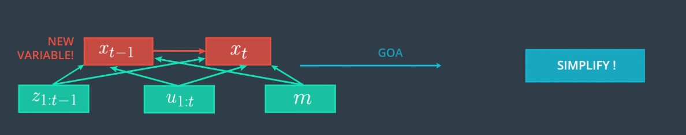t-1</sub>" width="600" height="200"> </p> 


Before explaining of how we can simplify it, I want to introduce the first order Markov Assumption. Assume you want to estimate the posterior distribution of p(x<sub>t</sub>) given our previous states (x<sub>t-1</sub>) and you have no observations or controls. This is a pretty simple example but it works fine to explain the Markov Assumption. You can write this distribution as the following: This relation can be represented as a chain.

<p align="right">  </p> 

For example, to estimate x1, we only use x0 and to estimate x2, we use x1 and x0 and finally, for x3 we use x2, x1, and x0. In this example, the Markov Assumption postulates that x2 is the best predictor for x3.This means, that the other states, x1 and x0 or future states carry no additional information to predict x3 in a better way far more accurately. We also say the state x2 is complete.

We remove the links or connectors between x1 and x3 and x0 and x3, which means x3 is independent of x0 and x1. It only depends on x2. Of course, for x2, it is the same and you can remove the connections. 


<p align="right">  </p> 


Since we now assume, that x<sub>t</sub> only depends on the previous state we can rewrite the posterior in the way presented in the above figure if we want to continue this chain, which means to predict the future, we only take x3 into consideration. An example could be a weather forecaster, the weather of tomorrow only depends on today and today includes our previous information and is uncertain, of course. As an important fact we have to assume that we have an initial guess for x0.  x0 must be initialized correctly. Let's go back to our motion model and I will show you how we can benefit from the Markov Assumption for simplifying  the below relation?

<p align="right"> t-1</sub>" width="600" height="200"> </p> 

First, I split the control vector into the current control u<sub>t</sub>, and our previous controls u<sub>1:t-1</sub>. 
By taking a look to the first term, the probability distribution of p(x<sub>t</sub>) is conditioned by x<sub>t-1</sub>, all previous observations or controls, and the map. we apply the Markov Assumption the first time, since you already know z<sub>1:t-1 </sub>and u<sub>1:t-1</sub> will not carry  additional information to predict x<sub>t</sub> in a better way(these values were already used to estimate x<sub>t-1</sub>). This means, x<sub>t</sub> is independent of these values. Because of this fact, we can remove the two conditions (number 1 and 2) in the graph and the posterior distribution (the 1st) of x<sub>t</sub> only depends on x<sub>t-1</sub>, u<sub>t</sub> and the map. This term is called the transition or system model, which moves the previous state in the new one. And as you can see in the system model term,we do not need the whole observation or control history and you can also consider that the map, m does not influence x<sub>t</sub>. It is common practice to neglect m but we keep it.


<p align="right">  </p> 

By looking at the second term, which describes a posterior distribution of x<sub>t-1</sub> given all previous observations or controls, and the map, we use a Markov Assumption again. 
We assume that u<sub>t</sub> tells us nothing about x<sub>t-1</sub> because u<sub>t</sub>  is in the future then we ignore u<sub>t</sub> to estimate the state x<sub>t-1</sub> and we remove the connection (3). Based on this assumption,we rewrite the motion model again (the 2nd). 

We have achieved a very important step towards the final form of our recursive state estimator. Let’s see why. If we rewrite the second term (see below figure) in our integral to split z<sub>1-t</sub> to z<sub>t-1</sub> and z<sub>t-2</sub> we arrive at a function that is exactly the belief from the previous time step, namely bel(x<sub>t-1</sub>).

<p align="right"> 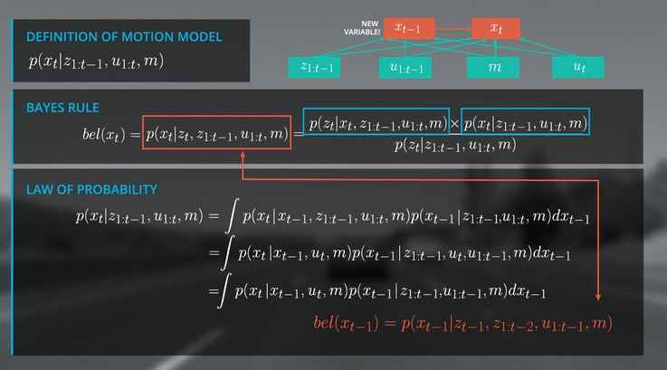 </p> 

 Now we can rewrite out integral as the belief of x<sub>t-1</sub>.
 <p align="right"> 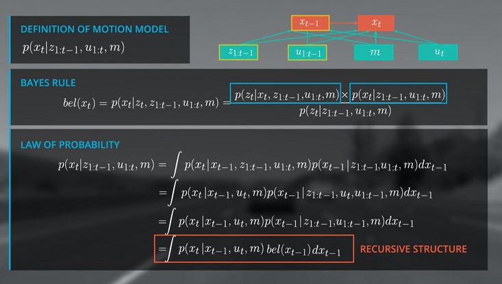 </p> 
 

The amazing thing is that we have a recursive update formula and can now use the estimated state from the previous time step to predict the current state at t. This is a critical step in a recursive Bayesian filter because it renders us independent from the entire observation and control history. So in the graph structure, we will replace the previous state terms (highlighted in above figure) with our belief of the state at x<sub>t−1</sub>, which leads to a new structure presented in the figure below.

 <p align="right"> 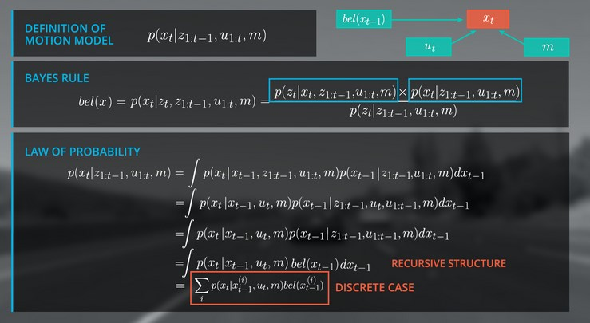 </p> 
 
 Finally, we replace the integral by a sum over all x<sup>i</sup> because we have a discrete localization scenario in this case, to get the same formula  for localization. The process of predicting x<sub>t</sub> with a previous beliefs (x<sub>t−1</sub>) and the transition model is technically a convolution. If you take a look to the formula again, it is essential that the belief at x<sub>t=0</sub> is initialized with a meaningful assumption. It depends on the localization scenario how you set the belief or in other words, how you initialize your filter. For example, you can use GPS to get a coarse estimate of your location.
 

let's sum up to the points You learned:

* How to apply the law of total probability by including the new variable, x_t minus one. 
* You also learned about the Markov Assumption, which is very important for probabilistic reasoning. 
* Finally, you learned how to derive the recursive filter structure. 

 <p align="right"> 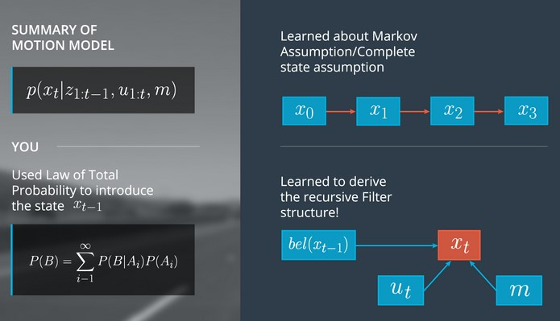 </p> 


Next, you will implement a motion model in C++. You will also learn how to initialize our localizer, which means, defining the belief of the state at the very beginning.


 

## 5. Implementation for Motion Model

Before you start coding, you will need some details to help with implementing the prediction step. At the very beginning, the assumptions are: 

* The car is parked at a tree or a street lamp plus/minus one meter. 
* The transition model is controlled only by x<sub>t-1<sub> and u<sub>t<sub>. Here we assume, the transition model is independent from the map. 
 
* Remember that ut is a direct move pointed in driving direction. 

* The transition model is defined by the 1D normal distribution defined by the mean ut and sigma u<sub>t<sub>, Here, the sigma of u<sub>t<sub> is one meter. 

•	The state space range is from zero to 99 meters with a one-meter step resolution. 


 <p align="right"> 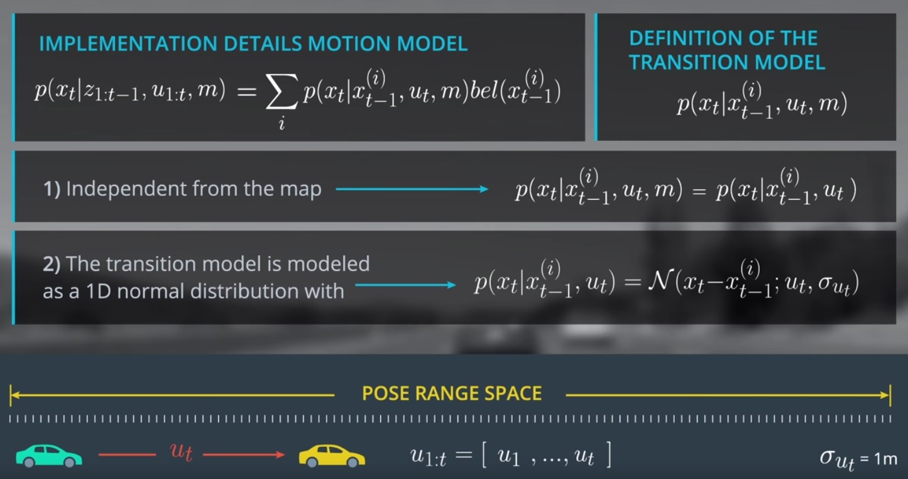 </p> 


#### 5.1 Determine Probabilities:


Now you have all information to implement the motion model but before implementing the motion model, we need a function to which we can pass model parameters/values and return a probability. Fortunately, we can use a normalized probability density function (PDF). 

[Normpdf](https://github.com/A2Amir/Markov-Localization-and-the-Kidnapped-Vehicle-/blob/master/C%2B%2B/DetermineProbabilities.cpp) is a C++ function in which the below presented Gaussian Distribution is implemented and accepts a parameter (mu), a value (x) and a standard deviation (std), returning a probability.


 <p align="right"> 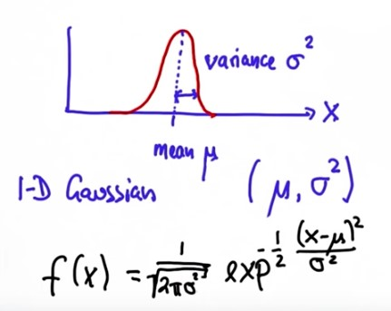 </p> 

Using normpdf we are going to determine transition model probabilities. Specifically, we need to determine the probability of moving from x<sub>t−1</sub> ---- a control parameter---> x<sub>t</sub>. For example, if our pseudo position (x<sub>t</sub>) is 8 and our pre-pseudo position is 5 (x<sub>t−1</sub>), the sample value will be 3, and our transition will be from x<sub>t−1</sub> --- 3 --> x<sub>t</sub>. Or Given pseudo position x<sub>t</sub> and a control parameter of 1 (move 1 unit each time step), the pre-pseudo position x<sub>t−1</sub> that maximizes our probability is 1.

#### 5.2 Motion Model Probabiity:

Recall that we derived the following recursive structure for the motion model:

 <p align="right"> 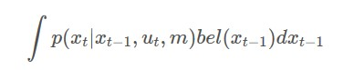 </p> 
 
 and that we will implement this in the discretized form:
 
  <p align="right"> 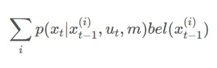 </p> 

Let's consider again what the summation above is doing - calculating the probability that the vehicle is now at a given location x<sub>t</sub>.
How is the summation doing that? It's looking at each prior location where the vehicle could have been, x<sub>t-1</sub> then the summation iterates over every possible prior location x<sup>(1)</sup><sub>t−1</sub>...x<sup>(n)</sup><sub>t−1</sub>. For each possible prior location in that list, x<sup>(i)</sup><sub>t−1</sub>, the summation yields the total probability that the vehicle really did start at that prior location and that it wound up at x<sub>t</sub>.

That now raises the question, how do we calculate the individual probability that the vehicle really did start at that prior location and that it wound up at x<sub>t</sub>, for each possible starting position x<sub>t-1</sub>? That's where each individual element of the summation contributes. The likelihood of starting at x<sub>t-1</sub> and arriving at x is simply p(x<sub>t</sub>∣x<sub>t-1</sub>)∗p(x<sub>t-1</sub>).

We can say the same thing, using different notation and incorporating all of our knowledge about the world, by writing: p(x<sub>t</sub>∣x<sup>(i)</sup><sub>t-1</sub>,u<sub>t</sub>,m)∗bel(x<sup>(i)</sup><sub>t-1</sub>)
From the equation above we can see that our final position probability is the sum of n discretized motion model calculations, where each calculation is the product of the 'i'th transition probability, p(x<sub>t</sub>∣x<sub>t-1</sub><sup>(i)</sup>,u<sub>t</sub>,m) and 'i'th belief state, bel(x<sup>(i)</sup><sub>t-1</sub>).Some examples of the calulation of Motion Model Probabiity are [here](https://github.com/A2Amir/Markov-Localization-and-the-Kidnapped-Vehicle-/blob/master/Python/Markov%20Localization%20.ipynb) explained
In the next concept we will implement the motion model in C++.

  <p align="right"> 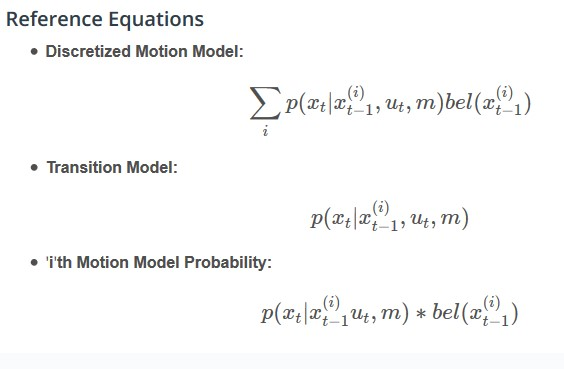 </p> 
